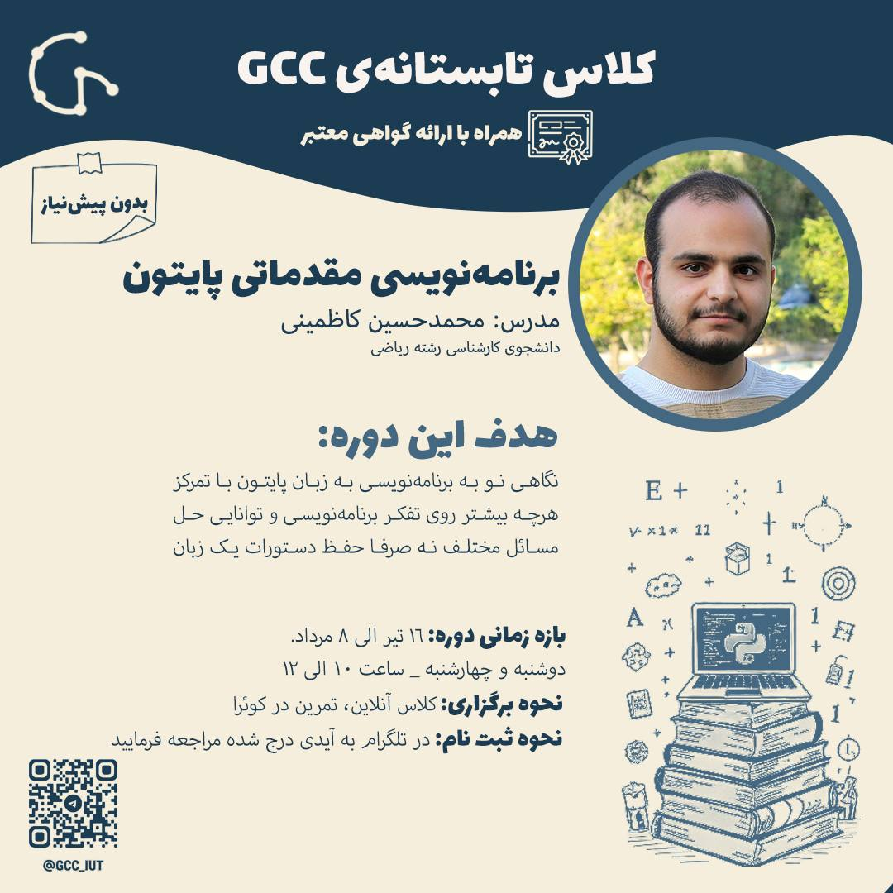
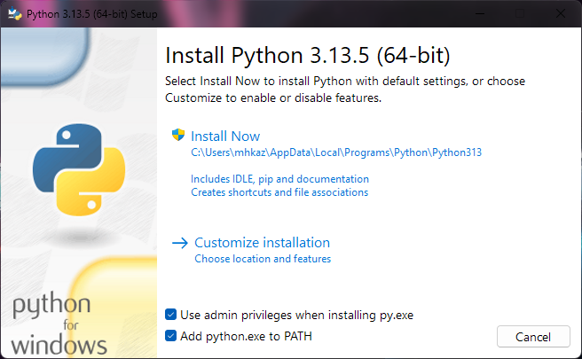
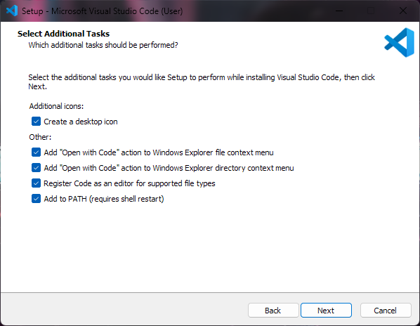
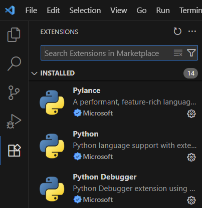

# دوره برنامه‌نویسی مقدماتی پایتون GCC
ارائه شده توسط باشگاه GCC زیر نظر اساتید و دانشکده علوم ریاضی دانشگاه صنعتی اصفهان

مدرس: محمدحسین کاظمینی  
دانشجوی رشته ریاضی  
سابقه تدریس و دستیار آموزشی

## اطلاعات دوره

## سرفصل ها
معرفی و بررسی و راه‌اندازی پایتون  
متغیرها و عملگرها و نکات محاسباتی
روش‌های ورودی گرفتن و نمایش خروجی  
شرط تودرتو، عملگرهای مقایسه‌ای  
انواع حلقه و دستورات کنترلی آن  
ساختار داده‌ها و بررسی و کاربرد آنها  
بررسی کامل تابع و ماژولار نوشتن کد  
نحوه استفاده از کتابخانه‌ها  

## فایل جلسات

| جلسه | موضوع | فایل کد |
|:---:|:-------------:|:-------------------:|
| 0 | تست پایتون | &lrm;`00-test.py` |
| 1 | کتابخونه-متغیر-عملگر-ورودی-خروجی | &lrm;`01-lib-var-op-in-out.py` |
| 2 | انواع شرط و شروع حلقه و مثال | &lrm;`02-if-while.py` |
| 3 | ادامه حلقه و تعریف تابع و بررسی کامل رشته | &lrm;`03-while-func-str.py` |
| 4 | تکمیل حلقه و بررسی تمامی ساختار داده ها | &lrm;`04-for-list-tuple-dict-set.py` |

## نصب و راه‌اندازی پایتون و ویرایشگر کد در ویندوز 64 بیتی
### نصب پایتون
فایل نصبی پایتون را از لینک زیر دانلود کنید و برای نصب طبق عکس همه آپشن‌ها را فعال کنید و در نهایت سیستم را ریستارت کنید.

https://www.python.org/ftp/python/3.13.5/python-3.13.5-amd64.exe

### نصب ویرایشگر VS Code
فایل نصبی VS Code را از لینک زیر دانلود کنید و برای نصب طبق عکس همه آپشن‌ها را فعال کنید و در نهایت سیستم را ریستارت کنید.

https://code.visualstudio.com/sha/download?build=stable&os=win32-x64-user

### آماده سازی VS Code
در بخش افزونه‌های VS Code این 3 مورد را طبق عکس نصب کنید.

## ارتباط

اطلاعات تکمیلی:
[کانال تلگرام GCC](https://t.me/gcc_iut)

ارتباط با من:
https://M-H-K.ir
